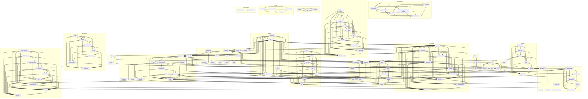

# Component Relationship Graph

This diagram shows relationships between Fundamental Styles components.

## Legend
- **Solid arrows** (-->): Direct dependencies (imports)
- **Dashed arrows** (-.->): Related components
- **Thick arrows** (==>): Similar components (same category)

## Full Graph

```mermaid
graph TB
  subgraph cat_toolbars
    action-bar["Action Bar"]
    action-sheet["Action Sheet"]
    bar["Bar"]
    title-bar["Title Bar"]
    tool-header["Tool Header"]
    toolbar["Toolbar"]
  end
  subgraph cat_ai-components
    ai-busy-indicator["Ai Busy Indicator"]
    ai-loading-bar["Ai Loading Bar"]
    ai-text["Ai Text"]
    ai-writing-assistant-versioning["Ai Writing Assistant Versioning"]
    ai-writing-assistant["Ai Writing Assistant"]
    prompt-input["Prompt Input"]
  end
  subgraph cat_feedback
    alert["Alert"]
    busy-indicator["Busy Indicator"]
    illustrated-message["Illustrated Message"]
    message-page["Message Page"]
    message-strip["Message Strip"]
    message-toast["Message Toast"]
    notification["Notification"]
    progress-indicator["Progress Indicator"]
    skeleton["Skeleton"]
    status-indicator["Status Indicator"]
  end
  subgraph cat_visual
    avatar-group["Avatar Group"]
    avatar["Avatar"]
    badge["Badge"]
    counter["Counter"]
    icon["Icon"]
    info-label["Info Label"]
    object-identifier["Object Identifier"]
    object-number["Object Number"]
    object-status["Object Status"]
  end
  subgraph cat_navigation
    breadcrumb["Breadcrumb"]
    horizontal-navigation["Horizontal Navigation"]
    icon-tab-bar["Icon Tab Bar"]
    link["Link"]
    navigation-list["Navigation List"]
    navigation-menu["Navigation Menu"]
    navigation["Navigation"]
    pagination["Pagination"]
    shellbar["Shellbar"]
    side-nav["Side Nav"]
    tabs["Tabs"]
    vertical-nav["Vertical Nav"]
  end
  subgraph cat_buttons
    button-split["Button Split"]
    button["Button"]
    menu["Menu"]
    segmented-button["Segmented Button"]
  end
  subgraph cat_date-time
    calendar["Calendar"]
    time["Time"]
    timepicker["Timepicker"]
  end
  subgraph cat_containers
    card["Card"]
    facet["Facet"]
    page-footer["Page Footer"]
    page["Page"]
    panel["Panel"]
    section["Section"]
    tile["Tile"]
  end
  subgraph cat_specialized
    carousel["Carousel"]
    dynamic-page["Dynamic Page"]
    micro-process-flow["Micro Process Flow"]
    product-switch["Product Switch"]
    settings["Settings"]
    upload-collection["Upload Collection"]
    user-menu["User Menu"]
    variant-management["Variant Management"]
    wizard["Wizard"]
  end
  subgraph cat_form-inputs
    checkbox["Checkbox"]
    file-uploader["File Uploader"]
    input-group["Input Group"]
    input["Input"]
    radio["Radio"]
    rating-indicator["Rating Indicator"]
    search-field["Search Field"]
    select["Select"]
    slider["Slider"]
    step-input["Step Input"]
    switch["Switch"]
    textarea["Textarea"]
  end
  subgraph cat_typography
    code["Code"]
    text["Text"]
    title["Title"]
  end
  subgraph cat_dialogs
    dialog["Dialog"]
    message-box["Message Box"]
    message-popover["Message Popover"]
    popover["Popover"]
    quick-view["Quick View"]
  end
  subgraph cat_layout
    dynamic-side-content["Dynamic Side Content"]
    fixed-card-layout["Fixed Card Layout"]
    flexible-column-layout["Flexible Column Layout"]
    layout-grid["Layout Grid"]
    layout-panel["Layout Panel"]
    layout["Layout"]
    resizable-card-layout["Resizable Card Layout"]
    splitter["Splitter"]
    tool-layout["Tool Layout"]
  end
  subgraph cat_social
    feed-input["Feed Input"]
    feed-list["Feed List"]
  end
  subgraph cat_form-layout
    fieldset["Fieldset"]
    form-group["Form Group"]
    form-header["Form Header"]
    form-item["Form Item"]
    form-label["Form Label"]
    form-layout-grid["Form Layout Grid"]
    form-message["Form Message"]
  end
  subgraph cat_tags
    generic-tag["Generic Tag"]
    object-marker["Object Marker"]
    token["Token"]
    tokenizer["Tokenizer"]
  end
  subgraph cat_data-display
    grid-list["Grid List"]
    list["List"]
    object-list["Object List"]
    table["Table"]
    tree["Tree"]
  end
  subgraph cat_utilities
    helpers["Helpers"]
    margins["Margins"]
    off-screen["Off Screen"]
    paddings["Paddings"]
    scrollbar["Scrollbar"]
  end
  subgraph cat_business-objects
    numeric-content["Numeric Content"]
    object-attribute["Object Attribute"]
  end

  avatar-group --> avatar
  fieldset --> form-group
  form-layout-grid --> layout-grid
  helpers --> layout
  object-list --> list
  avatar-group ==> avatar
  badge ==> counter
  bar ==> message-box
  bar ==> settings
  bar ==> user-menu
  message-box ==> settings
  message-box ==> user-menu
  settings ==> user-menu
  breadcrumb ==> illustrated-message
  breadcrumb ==> link
  breadcrumb ==> scrollbar
  breadcrumb ==> splitter
  illustrated-message ==> link
  illustrated-message ==> scrollbar
  illustrated-message ==> splitter
  link ==> scrollbar
  link ==> splitter
  scrollbar ==> splitter
  button-split ==> button
  button-split ==> input-group
  button-split ==> pagination
  button-split ==> product-switch
  button-split ==> segmented-button
  button-split ==> shellbar
  button-split ==> tile
  button ==> input-group
  button ==> pagination
  button ==> product-switch
  button ==> segmented-button
  button ==> shellbar
  button ==> tile
  input-group ==> pagination
  input-group ==> product-switch
  input-group ==> segmented-button
  input-group ==> shellbar
  input-group ==> tile
  pagination ==> product-switch
  pagination ==> segmented-button
  pagination ==> shellbar
  pagination ==> tile
  product-switch ==> segmented-button
  product-switch ==> shellbar
  product-switch ==> tile
  segmented-button ==> shellbar
  segmented-button ==> tile
  shellbar ==> tile
  button-split ==> carousel
  button ==> carousel
  carousel ==> input-group
  carousel ==> pagination
  carousel ==> product-switch
  carousel ==> segmented-button
  carousel ==> shellbar
  carousel ==> tile
  button ==> feed-input
  feed-input ==> shellbar
  button ==> message-box
  feed-input ==> message-box
  message-box ==> shellbar
  button ==> tree
  pagination ==> tree
  button ==> icon-tab-bar
  button ==> search-field
  button ==> navigation
  button ==> message-popover
  button ==> message-strip
  icon-tab-bar ==> message-popover
  icon-tab-bar ==> message-strip
  icon-tab-bar ==> shellbar
  message-popover ==> message-strip
  message-popover ==> shellbar
  message-strip ==> shellbar
  icon-tab-bar ==> segmented-button
  message-popover ==> segmented-button
  message-strip ==> segmented-button
  button ==> dynamic-page
  dynamic-page ==> icon-tab-bar
  dynamic-page ==> message-popover
  dynamic-page ==> message-strip
  dynamic-page ==> segmented-button
  dynamic-page ==> shellbar
  button ==> object-status
  card ==> object-status
  carousel ==> message-page
  grid-list ==> toolbar
  icon-tab-bar ==> tabs
  icon-tab-bar ==> list
  icon ==> message-box
  list ==> object-list
  list ==> tree
  list ==> upload-collection
  menu ==> user-menu
  menu ==> panel
  menu ==> popover
  menu ==> scrollbar
  panel ==> popover
  panel ==> scrollbar
  popover ==> scrollbar
  navigation ==> user-menu
  navigation ==> popover
  panel ==> user-menu
  select ==> shellbar
  title ==> toolbar
  title ==> variant-management
  toolbar ==> variant-management
  action-bar ==> action-sheet
  action-bar ==> bar
  action-bar ==> title-bar
  action-bar ==> tool-header
  action-bar ==> toolbar
  action-sheet ==> bar
  action-sheet ==> title-bar
  action-sheet ==> tool-header
  action-sheet ==> toolbar
  bar ==> title-bar
  bar ==> tool-header
  bar ==> toolbar
  title-bar ==> tool-header
  title-bar ==> toolbar
  tool-header ==> toolbar
  ai-busy-indicator ==> ai-loading-bar
  ai-busy-indicator ==> ai-text
  ai-busy-indicator ==> ai-writing-assistant-versioning
  ai-busy-indicator ==> ai-writing-assistant
  ai-busy-indicator ==> prompt-input
  ai-loading-bar ==> ai-text
  ai-loading-bar ==> ai-writing-assistant-versioning
  ai-loading-bar ==> ai-writing-assistant
  ai-loading-bar ==> prompt-input
  ai-text ==> ai-writing-assistant-versioning
  ai-text ==> ai-writing-assistant
  ai-text ==> prompt-input
  ai-writing-assistant-versioning ==> ai-writing-assistant
  ai-writing-assistant-versioning ==> prompt-input
  ai-writing-assistant ==> prompt-input
  avatar-group ==> avatar
  avatar-group ==> badge
  avatar-group ==> counter
  avatar-group ==> icon
  avatar-group ==> info-label
  avatar-group ==> object-identifier
  avatar-group ==> object-number
  avatar-group ==> object-status
  avatar ==> badge
  avatar ==> counter
  avatar ==> icon
  avatar ==> info-label
  avatar ==> object-identifier
  avatar ==> object-number
  avatar ==> object-status
  badge ==> counter
  badge ==> icon
  badge ==> info-label
  badge ==> object-identifier
  badge ==> object-number
  badge ==> object-status
  counter ==> icon
  counter ==> info-label
  counter ==> object-identifier
  counter ==> object-number
  counter ==> object-status
  icon ==> info-label
  icon ==> object-identifier
  icon ==> object-number
  icon ==> object-status
  info-label ==> object-identifier
  info-label ==> object-number
  info-label ==> object-status
  object-identifier ==> object-number
  object-identifier ==> object-status
  object-number ==> object-status
  busy-indicator ==> progress-indicator
  button-split ==> button
  button-split ==> menu
  button ==> menu
  calendar ==> time
  calendar ==> timepicker
  time ==> timepicker
  card ==> facet
  card ==> page-footer
  card ==> page
  card ==> panel
  card ==> section
  card ==> tile
  facet ==> page-footer
  facet ==> page
  facet ==> panel
  facet ==> section
  facet ==> tile
  page-footer ==> page
  page-footer ==> panel
  page-footer ==> section
  page-footer ==> tile
  page ==> panel
  page ==> section
  page ==> tile
  panel ==> section
  panel ==> tile
  section ==> tile
  carousel ==> dynamic-page
  carousel ==> micro-process-flow
  carousel ==> product-switch
  carousel ==> settings
  carousel ==> upload-collection
  carousel ==> user-menu
  carousel ==> variant-management
  carousel ==> wizard
  dynamic-page ==> micro-process-flow
  dynamic-page ==> product-switch
  dynamic-page ==> settings
  dynamic-page ==> upload-collection
  dynamic-page ==> user-menu
  dynamic-page ==> variant-management
  dynamic-page ==> wizard
  micro-process-flow ==> product-switch
  micro-process-flow ==> settings
  micro-process-flow ==> upload-collection
  micro-process-flow ==> user-menu
  micro-process-flow ==> variant-management
  micro-process-flow ==> wizard
  product-switch ==> settings
  product-switch ==> upload-collection
  product-switch ==> user-menu
  product-switch ==> variant-management
  product-switch ==> wizard
  settings ==> upload-collection
  settings ==> user-menu
  settings ==> variant-management
  settings ==> wizard
  upload-collection ==> user-menu
  upload-collection ==> variant-management
  upload-collection ==> wizard
  user-menu ==> variant-management
  user-menu ==> wizard
  variant-management ==> wizard
  checkbox ==> radio
  checkbox ==> select
  radio ==> select
  code ==> text
  code ==> title
  text ==> title
  dynamic-side-content ==> fixed-card-layout
  dynamic-side-content ==> flexible-column-layout
  dynamic-side-content ==> layout-grid
  dynamic-side-content ==> layout-panel
  dynamic-side-content ==> layout
  dynamic-side-content ==> resizable-card-layout
  dynamic-side-content ==> splitter
  dynamic-side-content ==> tool-layout
  fixed-card-layout ==> flexible-column-layout
  fixed-card-layout ==> layout-grid
  fixed-card-layout ==> layout-panel
  fixed-card-layout ==> layout
  fixed-card-layout ==> resizable-card-layout
  fixed-card-layout ==> splitter
  fixed-card-layout ==> tool-layout
  flexible-column-layout ==> layout-grid
  flexible-column-layout ==> layout-panel
  flexible-column-layout ==> layout
  flexible-column-layout ==> resizable-card-layout
  flexible-column-layout ==> splitter
  flexible-column-layout ==> tool-layout
  layout-grid ==> layout-panel
  layout-grid ==> layout
  layout-grid ==> resizable-card-layout
  layout-grid ==> splitter
  layout-grid ==> tool-layout
  layout-panel ==> layout
  layout-panel ==> resizable-card-layout
  layout-panel ==> splitter
  layout-panel ==> tool-layout
  layout ==> resizable-card-layout
  layout ==> splitter
  layout ==> tool-layout
  resizable-card-layout ==> splitter
  resizable-card-layout ==> tool-layout
  splitter ==> tool-layout
  feed-input ==> feed-list
  fieldset ==> form-group
  fieldset ==> form-header
  fieldset ==> form-item
  fieldset ==> form-label
  fieldset ==> form-layout-grid
  fieldset ==> form-message
  form-group ==> form-header
  form-group ==> form-item
  form-group ==> form-label
  form-group ==> form-layout-grid
  form-group ==> form-message
  form-header ==> form-item
  form-header ==> form-label
  form-header ==> form-layout-grid
  form-header ==> form-message
  form-item ==> form-label
  form-item ==> form-layout-grid
  form-item ==> form-message
  form-label ==> form-layout-grid
  form-label ==> form-message
  form-layout-grid ==> form-message
  generic-tag ==> object-marker
  generic-tag ==> token
  generic-tag ==> tokenizer
  object-marker ==> token
  object-marker ==> tokenizer
  token ==> tokenizer
  grid-list ==> table
  helpers ==> margins
  helpers ==> off-screen
  helpers ==> paddings
  helpers ==> scrollbar
  margins ==> off-screen
  margins ==> paddings
  margins ==> scrollbar
  off-screen ==> paddings
  off-screen ==> scrollbar
  paddings ==> scrollbar
  horizontal-navigation ==> navigation-menu
  horizontal-navigation ==> navigation
  horizontal-navigation ==> vertical-nav
  navigation-menu ==> navigation
  navigation-menu ==> vertical-nav
  navigation ==> vertical-nav
  icon-tab-bar ==> tabs
  illustrated-message ==> message-page
  illustrated-message ==> message-toast
  illustrated-message ==> skeleton
  illustrated-message ==> status-indicator
  message-page ==> message-toast
  message-page ==> skeleton
  message-page ==> status-indicator
  message-toast ==> skeleton
  message-toast ==> status-indicator
  skeleton ==> status-indicator
  input ==> textarea
  list ==> object-list
  message-popover ==> quick-view
  numeric-content ==> object-attribute
  rating-indicator ==> slider
  rating-indicator ==> step-input
  slider ==> step-input
```

## Statistics

- **Total Components**: 120
- **Total Relationships**: 345
- **Relationships by Type**:
  - imports: 5
  - shares-styling: 105
  - similar: 235

## Category Distribution

- **toolbars**: 6 components
- **ai-components**: 6 components
- **feedback**: 10 components
- **visual**: 9 components
- **navigation**: 12 components
- **buttons**: 4 components
- **date-time**: 3 components
- **containers**: 7 components
- **specialized**: 9 components
- **form-inputs**: 12 components
- **typography**: 3 components
- **dialogs**: 5 components
- **layout**: 9 components
- **social**: 2 components
- **form-layout**: 7 components
- **tags**: 4 components
- **data-display**: 5 components
- **utilities**: 5 components
- **business-objects**: 2 components

---
**Script**: `scripts/generate-relationship-graph.js`
